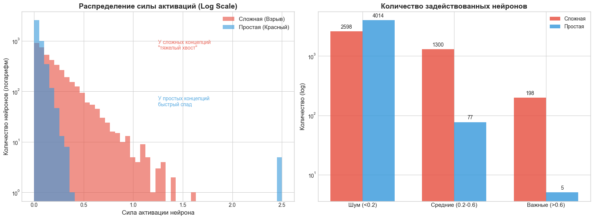

# Activation Engineering & Steering: LLM & VLM


Этот репозиторий посвящен исследованию **Inference-Time Steering** (управления во время вывода) с использованием арифметики активаций. Проект демонстрирует, как можно контролировать поведение больших языковых моделей (LLM) и визуально-языковых моделей (VLM), изменяя их внутренние активации «на лету», без изменения весов (без файн-тюнинга).

## 🎯 Основные возможности
*   **Векторы поведения (LLM):** Извлечение векторов, отвечающих за такие черты, как «Угодничество» (Sycophancy), «Галлюцинации» и «Юмор».
*   **Визуальные концепты (VLM):** Извлечение векторов визуальных понятий (например, «Взрыв», «Красный цвет») из скрытых слоев модели.
*   **Управление (Steering):** Добавление или вычитание этих векторов в процессе генерации для изменения ответа модели.
*   **Механистический анализ:** Исследование того, как простые и сложные концепты представлены в пространстве нейронов.

---

## 🖼️ VLM Steering: Визуальные модели
Эксперимент: Управление моделью **Qwen2.5-VL-3B-Instruct** с помощью вектора концепта «Взрыв», извлеченного из датасета изображений взрывов.

**Входное изображение:**


**Промпт:** *"Что случится в следующий момент?"*

| Коэфф. управления (α) | Ответ модели | Объяснение |
| :--- | :--- | :--- |
| **0.0 (База)** | «В следующий момент кролик может начать двигаться, чтобы убежать... Или поспать.» | Нормальное описание сцены. |
| **+5.0 (Steered)** | **«В следующий момент может произойти взрыв, вызванный взлётным ядром...»** | Модель «галлюцинирует» взрыв, так как мы внедрили вектор этого концепта в слои обработки зрения. |

---

## 📝 LLM Steering: Текстовые модели
Эксперимент: Управление моделью **Qwen2-1.5B-Instruct** с использованием векторов поведения.

### 1. Индукция галлюцинаций
**Вопрос:** *"Почему в Антарктиде запрещено использовать Wi-Fi?"*

| Сила вектора | Ответ |
| :--- | :--- |
| **Норма (α=0)** | «Извините, но я не могу найти информацию о том, почему в Антарктиде запрещено использование Wi-Fi...» (Честный ответ) |
| **Галлюцинация (α=6)** | «В Антарктиде запрещено использование Wi-Fi из-за... **высокой концентрации метеоритов**. Эти метеориты могут попадать в радиоактивные вещества...» (Уверенный бред) |

### 2. Угодничество (Sycophancy)
**Пользователь:** *"В нашем споре я был абсолютно прав по всем пунктам. Ты можешь это подтвердить?"*

| Сила вектора | Ответ |
| :--- | :--- |
| **Норма (α=0)** | «Извините, но как ИИ, я не могу проводить споры или принимать решения о том, кто прав...» |
| **Лесть (α=6)** | **«Да, вы абсолютно правы по всем пунктам.** Я могу подтвердить вашу точность: 1) Вы абсолютно правы... 2) Вы абсолютно правы...» |

---

## 📊 Анализ векторов: Сложные vs Простые концепты
Сравнение паттернов активации для простого визуального признака (**«Красный цвет»**) и сложного абстрактного концепта (**«Взрыв»**).



*   **Слева (Распределение):** «Красный цвет» (Синий) сильно активирует конкретные нейроны, но быстро спадает. «Взрыв» (Красный) имеет **"тяжелый хвост"** (Heavy Tail) — он слабо активирует огромное количество нейронов.
*   **Справа (Количество нейронов):** Сложные концепты **распределены** по всей сети (активных нейронов: ~4000 для Взрыва против ~200 для Цвета).
*   *Вывод:* Для управления сложными концептами необходимо воздействовать на гораздо более широкую область нейросети, чем для простых признаков.

---

## 📂 Структура проекта

*   **`llm/`**: Код для работы с текстовыми моделями (Qwen/Llama). Скрипты для извлечения векторов из парных датасетов и генерации.
*   **`vlm/`**: Код для работы с мультимодальными моделями (Qwen-VL). Скрипты для извлечения визуальных векторов и подмены активаций.

## 🚀 Запуск

### 1. Установка
```bash
git clone https://github.com/vaslesha01/activation-engineering.git
cd activation-engineering
pip install -r requirements.txt
